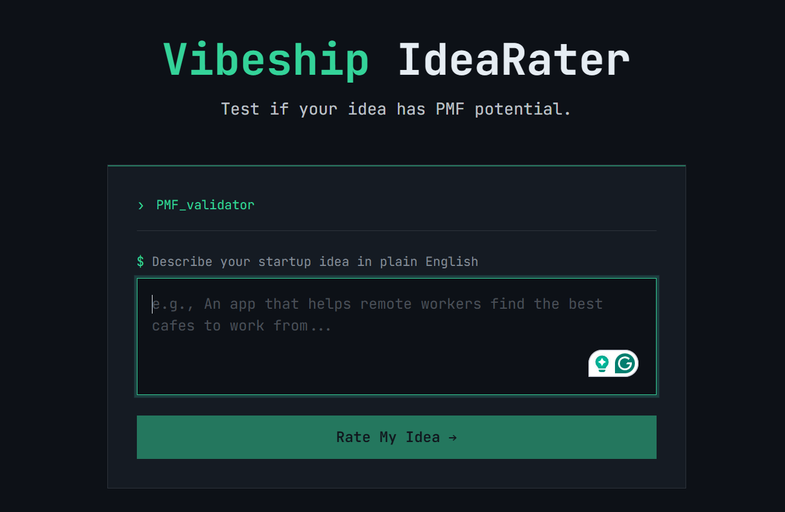
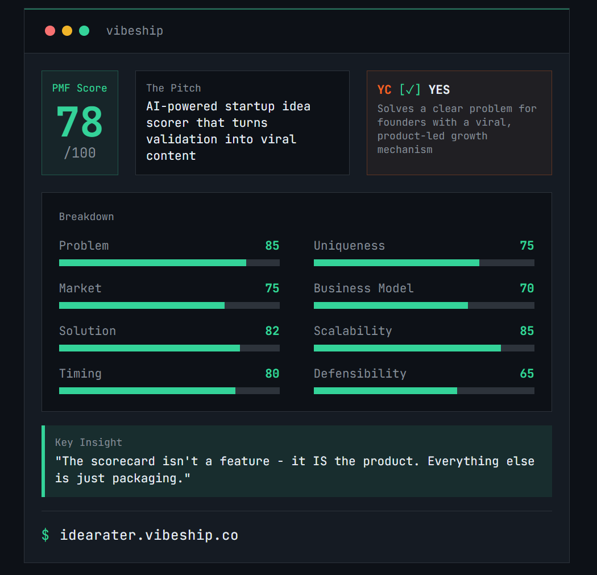

# Vibeship IdeaRater

Test if your startup idea has PMF (Product-Market Fit) potential. Get a brutally honest scorecard in 30 seconds.

**Free to use. Powered by Anthropic Claude.**

**[Try it live at idearater.vibeship.co](https://idearater.vibeship.co)**

## How It Works

1. Describe your startup idea in plain English
2. Get rated across 8 dimensions
3. Receive an overall PMF score out of 100
4. Share your scorecard or use stealth mode to hide your idea

## The Scorecard

### PMF Score

Your overall Product-Market Fit score out of 100. This is a weighted calculation based on all 8 dimensions below.

### The Pitch

An AI-generated one-liner that captures the essence of your idea - useful for refining how you describe your startup.

### YC Verdict

A Y Combinator-style assessment: would this idea get into YC? Shows **YES** or **NO** with reasoning based on whether it solves a clear problem with a viable growth mechanism.

### Breakdown (8 Dimensions)

| Dimension | What It Measures |
|-----------|------------------|
| **Problem** | Is this a real, painful problem people have? How urgent is the need? |
| **Market** | How big is the potential market? Is it growing? |
| **Solution** | Does your solution actually solve the problem well? |
| **Timing** | Is now the right time for this? Are conditions favorable? |
| **Uniqueness** | What makes this different from existing solutions? |
| **Business Model** | Is there a clear path to revenue? Will people pay? |
| **Scalability** | Can this grow without proportional cost increases? |
| **Defensibility** | What's your moat? Can competitors easily copy this? |

### Key Insight

A brutally honest takeaway - the one thing you need to hear about your idea, delivered in the style of a seasoned startup advisor.

## Privacy & Data

**Your ideas are never stored.** There is no database. When you submit an idea:

- It goes directly to Anthropic's Claude API for analysis
- The response is sent back to your browser
- Nothing is saved on our servers
- Once you close the tab, the idea is gone

We use Google Analytics for basic usage tracking (page views, not your ideas).

## Tech Stack

- SvelteKit + TypeScript
- Tailwind CSS v4
- Claude Haiku (Anthropic API)
- Hosted on Railway

## Part of the Vibeship Ecosystem

- [Vibeship](https://vibeship.co) - Main ecosystem
- [Scanner](https://scanner.vibeship.co) - Code scanner
- [Mind](https://mind.vibeship.co) - AI memory
- [Spawner](https://spawner.vibeship.co) - Project spawner

## License

Apache 2.0 - See [LICENSE](LICENSE) for details.
